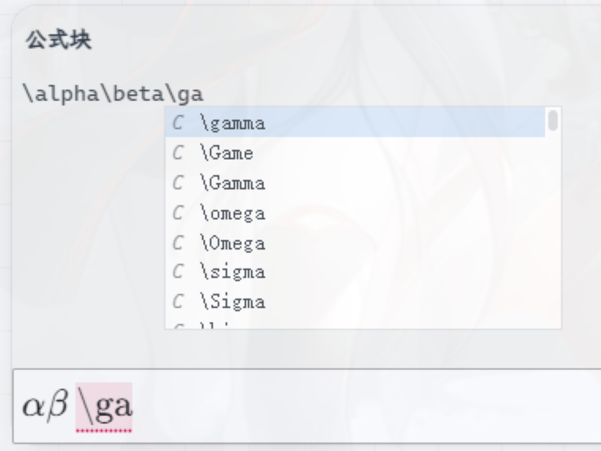

[中文](https://github.com/WingDr/siyuan-plugin-enhance-editor/blob/main/README_zh_CN.md)

# Enhance Editor

## Usage

After installing the plugin, it will automatically switch to the new editor when opening a formula block/HTML block editor and provide code hints.The provided shortcuts in the editor are for Visual Studio Code.

## Feature Preview

This plugin primarily offers code hints for KaTex. Typing a backslash (`\`) will bring up a hint box.

When used in conjunction with the [siyuan-math-enhance](https://github.com/zxhd863943427/siyuan-math-enhance) plugin, you can write formulas using LaTeX syntax and then correct them with the math enhancement plugin.

## Known Issues

1. Incompatible with the [Misuzu](https://github.com/Misuzu2027/syplugin-misuzu-custom), which causes the opened editor to be unable to resize.

## Acknowledgements

[CodeMirror Official Site](https://codemirror.net/)

[siyuan-math-enhance](https://github.com/zxhd863943427/siyuan-math-enhance)
