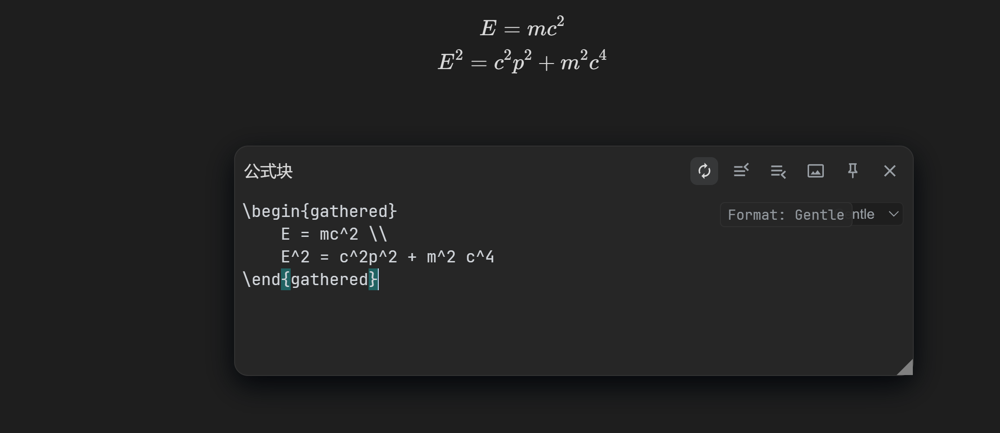

[中文](https://github.com/WingDr/siyuan-plugin-enhance-editor/blob/main/README_zh_CN.md)

# Enhance Editor

## Usage

After installing the plugin, it will automatically switch to the new editor when opening a formula block/HTML block/embed block editor and provide code hints.The provided shortcuts in the editor are for Visual Studio Code.

It is highly recommended to use with [siyuan-plugin-math-enhance插件](https://github.com/Xuanyiyiren/siyuan-plugin-enhance-editor/blob/main/README_zh_CN.md).

## Feature Preview

This plugin primarily offers code hints for KaTex. Typing a backslash (`\`) will bring up a hint box.

When used in conjunction with the [siyuan-math-enhance](https://github.com/zxhd863943427/siyuan-math-enhance) plugin, you can write formulas using LaTeX syntax and then correct them with the math enhancement plugin.

## New features (this iteration)

These features were added on top of the original repository:

- Formatting modes with quick toggle:
	- Off: no formatting, no auto-brackets in math blocks.
	- Gentle: whitespace-only cleanup (normalize newlines, trim trailing spaces), no reflow, no auto-brackets.
	- Original: Prettier (prettier-plugin-latex) formatting and auto-brackets enabled.
- A mode selector in the editor toolbar: “Format: Off/Gentle/Original”.
- Manual format hotkey: Alt+Shift+F. A short overlay toast shows the current mode, e.g. “Format: Gentle”.
- In math mode, reverse sync (textarea → editor) is disabled to prevent external forced formatting; editor → textarea sync remains.
- UI labels, overlay text, logs, and all new strings are in English.

Gentle mode example

## Motivation and process

- This iteration was primarily for my own use case. I previously had no experience with Node.js; the code changes were implemented by AI end-to-end.
- All Chinese comments/strings in the adapted code paths were replaced with English by AI to keep the UI and outputs consistent.
- AI used: GPT-5.

Why these changes?

- I strongly dislike Prettier's LaTeX formatting (aggressive reflow, auto-bracketing, etc.). The goal was to stop forced formatting by default and provide alternatives:
	- Off to keep text exactly as typed.
	- Gentle to do only safe whitespace cleanup without changing line structure.

## Known Issues

1. Incompatible with the [Misuzu](https://github.com/Misuzu2027/syplugin-misuzu-custom), which causes the opened editor to be unable to resize.

## Acknowledgements

[CodeMirror Official Site](https://codemirror.net/)

[siyuan-math-enhance](https://github.com/zxhd863943427/siyuan-math-enhance)
