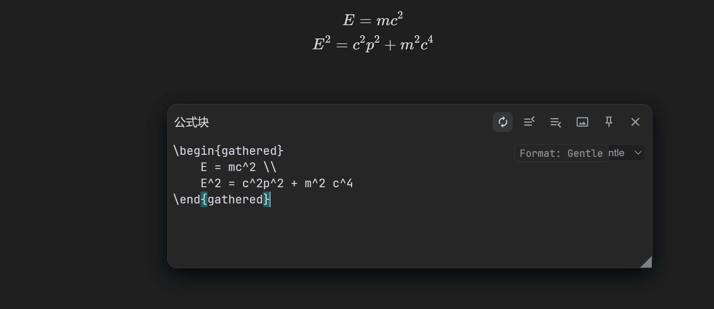

[English](https://github.com/Xuanyiyiren/siyuan-plugin-enhance-editor/blob/main/README.md)

# 增强编辑器

## 使用方法

安装插件后，打开公式块/HTML块/嵌入块编辑器时会自动切换为新编辑器，并提供代码提示。编辑器内提供的是vscode快捷键设置。

强烈推荐和[siyuan-plugin-math-enhance](https://github.com/zxhd863943427/siyuan-plugin-math-enhance)一起使用。

## 功能预览

本插件主要提供KaTex的代码提示，键入`\`即可出现提示框。

和 [siyuan-math-enhance](https://github.com/zxhd863943427/siyuan-math-enhance) 插件联用，可以达到平常用latex语法编写公式，然后用数学增强插件校正。

## 本次新增功能

- 三档格式化模式，可快速切换：
	- 关（Off）：不做任何格式化，数学块不自动补全括号。
	- 温（Gentle）：仅做空白清理（规范换行、去除行尾空格），不重排，不自动补全括号。
	- 原（Original）：使用 Prettier（prettier-plugin-latex）进行格式化，并开启自动补全括号。
- 编辑器工具栏新增模式下拉框：“Format: Off/Gentle/Original”。
- 手动格式化快捷键：Alt+Shift+F；触发后会显示英文浮层提示（如 “Format: Gentle”）。
- 数学模式下关闭从 textarea → 编辑器的反向同步，避免外部强制格式化，只保留编辑器 → textarea 的同步。
- 新增的 UI、浮层提示、日志与字符串全部为英文。

温和模式示例

## 初衷与实现方式

- 本次迭代主要为个人使用需求。我此前对 Node.js 几乎没有了解，本次代码改动由 AI 端到端完成。
- 在适配范围内，将原仓库代码中的中文注释/字符串全部替换为英文，以保持 UI 与输出的一致性。
- 使用的 AI：GPT-5。

为什么要做这些改动？

- 直接原因是我非常讨厌 Prettier 在 LaTeX 上的格式化（激进重排、自动括号等）。本次目标是在默认情况下彻底停止强制格式化，并提供替代方案：
	- 关：完全保持输入原样。
	- 温：仅做安全的空白清理，不改变行结构。

## 已知问题

1. 不能和[Misuzu插件](https://github.com/Misuzu2027/syplugin-misuzu-custom)一起使用，会导致打开的编辑器无法调整大小。

## 致谢

[CodeMirror官方站](https://codemirror.net/)

[siyuan-math-enhance](https://github.com/zxhd863943427/siyuan-math-enhance)